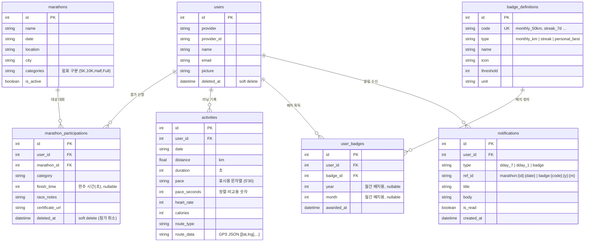

# Entity Relationship Diagram

> GitHub / VS Code / JetBrains에서 Mermaid 다이어그램으로 렌더링됩니다.

## 관계 한눈에 보기

```
                        ┌─────────────────┐
                        │      users      │
                        │─────────────────│
                        │ PK id           │
                        │    provider     │
                        │    provider_id  │
                        │    name         │
                        │    email        │
                        │    picture      │
                        └────────┬────────┘
                                 │ 1
              ┌──────────────────┼──────────────────┬──────────────────┐
              │ N                │ N                │ N                │ N
              ▼                  ▼                  ▼                  ▼
┌─────────────────────┐  ┌────────────┐  ┌──────────────┐  ┌──────────────────┐
│marathon_participations│ │ activities │  │ user_badges  │  │  notifications   │
│─────────────────────│  │────────────│  │──────────────│  │──────────────────│
│ PK id               │  │ PK id      │  │ PK id        │  │ PK id            │
│ FK user_id    ──────┘  │ FK user_id─┘  │ FK user_id ──┘  │ FK user_id ──────┘
│ FK marathon_id        │ │    date    │  │ FK badge_id  │  │    type          │
│    category           │ │    distance│  │    year      │  │    ref_id        │
│    finish_time        │ │    duration│  │    month     │  │    title         │
│    deleted_at         │ │    pace    │  │    awarded_at│  │    is_read       │
└──────────┬────────────┘ │ pace_secs  │  └──────┬───────┘  └──────────────────┘
           │ N            │ route_data │         │ N
           │              └────────────┘         │
           │ 1                                   │ 1
  ┌────────┴────────┐                  ┌─────────┴────────┐
  │    marathons    │                  │ badge_definitions │
  │─────────────────│                  │──────────────────│
  │ PK id           │                  │ PK id            │
  │    name         │                  │ UK code          │
  │    date         │                  │    type          │
  │    location     │                  │    name          │
  │    city         │                  │    icon          │
  │    categories   │                  │    threshold     │
  │    is_active    │                  │    unit          │
  └─────────────────┘                  └──────────────────┘
```

---

## Mermaid ER Diagram



---

## 유니크 제약 & 인덱스 요약

| 테이블 | 유니크 제약 | 목적 |
|--------|------------|------|
| `users` | `(provider, provider_id)` | 동일 소셜 계정 중복 가입 방지 |
| `marathon_participations` | `(user_id, marathon_id)` | 동일 대회 중복 신청 방지 |
| `user_badges` | `(user_id, badge_id, year, month)` | 동일 조건 배지 중복 수여 방지 |
| `notifications` | `(user_id, type, ref_id)` | D-Day·배지 알림 중복 생성 방지 |

| 테이블 | 인덱스 | 목적 |
|--------|--------|------|
| `activities` | `(user_id, distance)` | 최장 거리 최고기록 조회 |
| `activities` | `(user_id, duration)` | 최장 시간 최고기록 조회 |
| `activities` | `(user_id, pace_seconds)` | 최고 페이스 최고기록 조회 |
| `activities` | `(user_id, date)` | 날짜 범위·히트맵 조회 |
| `user_badges` | `(user_id)` | 사용자별 배지 목록 조회 |
| `notifications` | `(user_id, is_read)` | 미읽음 알림 카운트 조회 |
